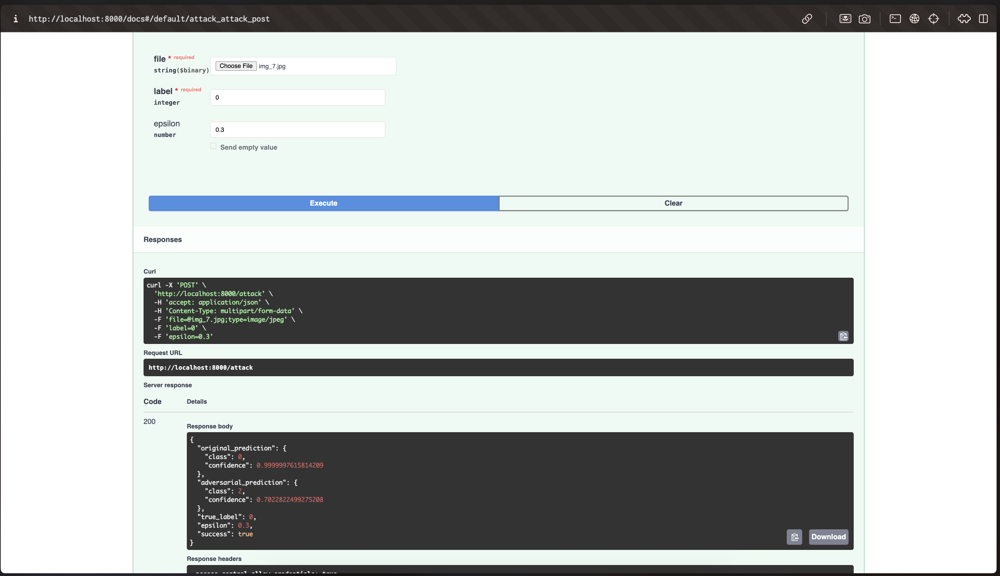
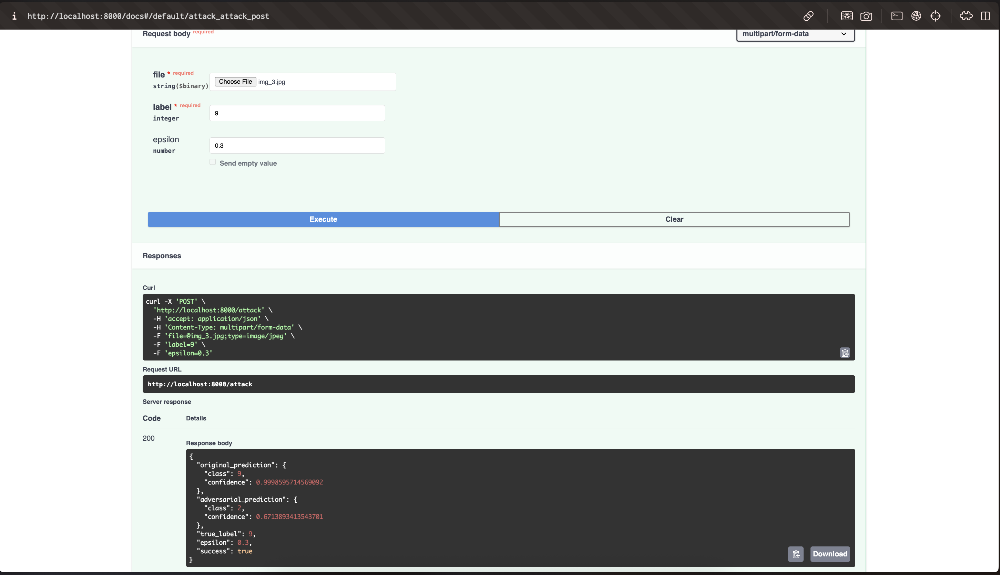
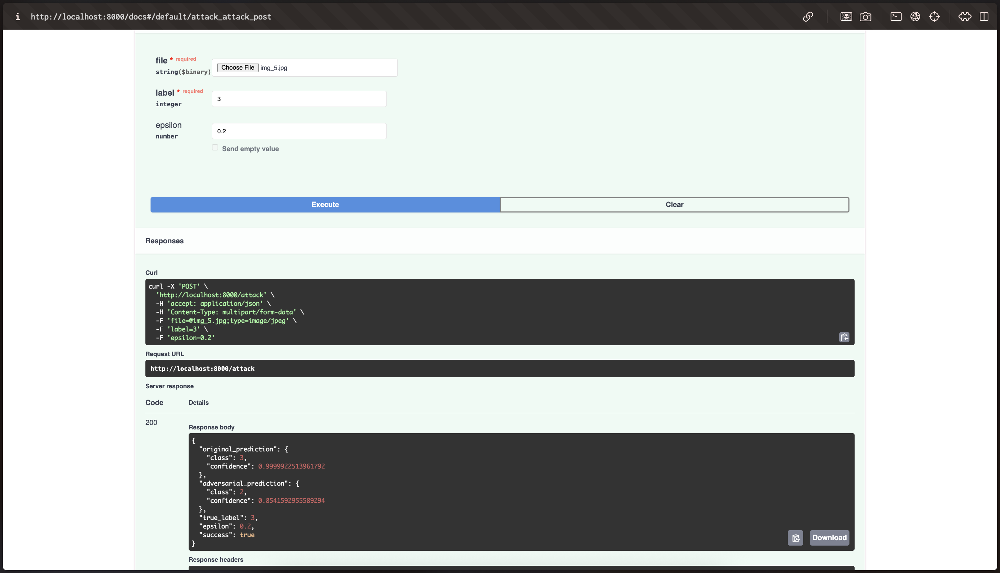
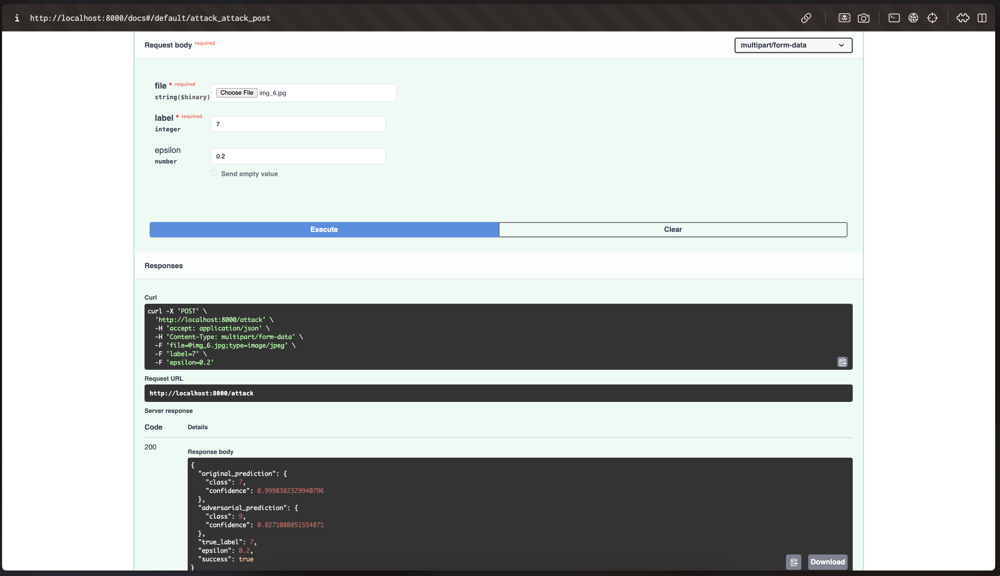

# FGSM-NeuralSiegeKit: Adversarial Attack Implementation

## Project Overview
This project implements the Fast Gradient Sign Method (FGSM) and its Gaussian noise variant for adversarial attacks on neural networks. It includes a REST API for running attacks on input images and evaluating model robustness.

## Requirements
- Python 3.9+
- PyTorch 2.0+
- FastAPI 0.100+
- torchvision 0.15+
- uvicorn 0.15+
- numpy 1.22+
- Pillow 9.0+
- matplotlib 3.5+
- python-multipart 0.0.5+
- pydantic 2.0+

## Setup Instructions

### 1. Clone the repository:
```bash
git clone https://github.com/yourusername/FGSM-NeuralSiegeKit.git
cd FGSM-NeuralSiegeKit
```

### 2. Set up a Python virtual environment (recommended):
```bash
# Create a virtual environment
python -m venv venv

# Activate the virtual environment
# For macOS/Linux:
source venv/bin/activate
# For Windows:
# venv\Scripts\activate
```

### 3. Install dependencies:
```bash
pip install -r requirements.txt
```

### 4. Train the MNIST model:
```bash
python load_n_train_model.py
```
This will:
- Download the MNIST dataset if not already present
- Train a convolutional neural network on the MNIST dataset
- Save the trained model to `models/pretrained_mnist.pth`

### 5. Run the API server:
```bash
python app_fgsm.py
```
The server will start at http://localhost:8000

## Implementation Details

### FGSM Attack (fgsm.py)
- Implements the Fast Gradient Sign Method as described by Goodfellow et al.
- Input: model, image tensor, label, epsilon
- Output: adversarial image tensor
- Features:
  - Gradient-based perturbation
  - Configurable attack strength (epsilon)
  - GPU/CPU support

### Gaussian FGSM (fgsm_gaussian.py)
- Modified FGSM implementation using Gaussian noise
- Input: model, image tensor, label, epsilon (as standard deviation)
- Output: perturbed image tensor
- Features:
  - Gaussian noise perturbation
  - Same interface as standard FGSM
  - Configurable noise strength

### API Implementation (app_fgsm.py)
FastAPI-based REST API for running FGSM attacks:

#### Endpoints
1. POST /attack
   - Input:
     - file: Image file (JPEG/PNG)
     - label: True label (0-9)
     - epsilon: Attack strength (0.0 to 1.0)
   - Output:
     - Original prediction
     - Adversarial prediction
     - Attack success status
     - Confidence scores
     - Probability distributions

2. GET /health
   - Health check endpoint
   - Returns API and model status

## Usage

### Starting the API Server
```bash
python app_fgsm.py
```
The server will start at http://localhost:8000

### API Documentation
- Interactive API documentation: http://localhost:8000/docs
- Alternative documentation: http://localhost:8000/redoc

### Example API Request
```bash
curl -X 'POST' \
  'http://localhost:8000/attack' \
  -H 'accept: application/json' \
  -H 'Content-Type: multipart/form-data' \
  -F 'file=@image.jpg' \
  -F 'label=9' \
  -F 'epsilon=0.3'
```

### Example Response
```json
{
  "original_prediction": {
    "class": 9,
    "confidence": 0.9998,
    "probabilities": [...]
  },
  "adversarial_prediction": {
    "class": 2,
    "confidence": 0.6713,
    "probabilities": [...]
  },
  "true_label": 9,
  "epsilon": 0.3,
  "success": true
}
```

## Model Evaluation
The project includes evaluation of both FGSM and FGSM-Gaussian attacks on a pretrained MNIST model. Results are saved in:
- outputs/accuracy_report.json: Quantitative evaluation metrics
- outputs/screenshots/: Visual examples of attacks

## Test Results and Examples

### Results Images

#### Test Case 1: Digit 0 (img_7.jpg)
Original Image: 
Adversarial Result: 

#### Test Case 2: Digit 9 (img_3.jpg)
Original Image: 
Adversarial Result: 

#### Test Case 3: Digit 3 (img_5.jpg)
Original Image: 
Adversarial Result: 

#### Test Case 4: Digit 7 (img_6.jpg)
Original Image: 
Adversarial Result: 

Each adversarial result image shows:
- The original input image
- The generated adversarial example
- The model's predictions and confidence scores for both images
- The attack parameters used (epsilon value)

## References
- Goodfellow, I. J., Shlens, J., & Szegedy, C. (2014). Explaining and harnessing adversarial examples.:
https://arxiv.org/pdf/1412.6572